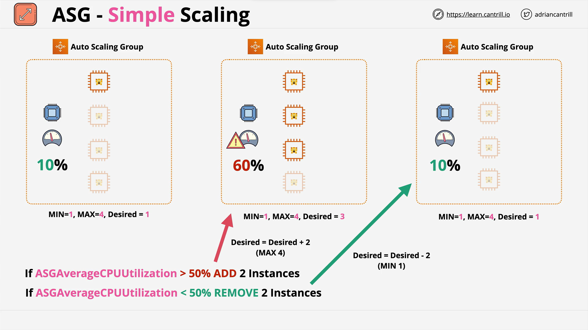
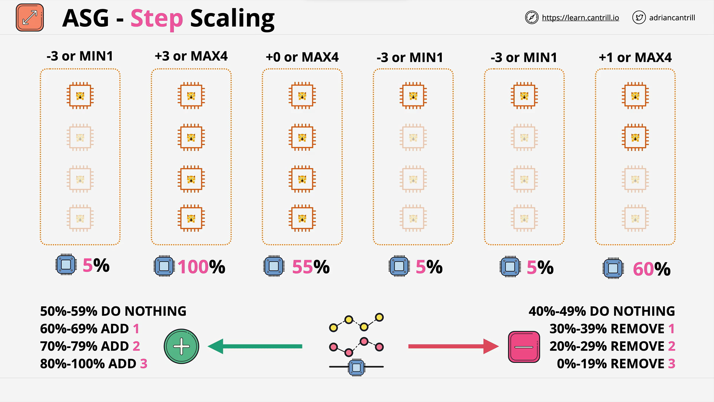

# Auto Scaling Groups

- Automatic Scaling and Self-Healing for EC2.
- Uses Launch Templates or Configurations.
- Has a `Minimum`, `Desired` and `Maximum` Size (e.g 1:2:4).
- Keep running instances at the `Desired Capacity` by `provisioning` or `terminating` instances.
- `Scaling Policies` automate based on metrics.

## Scaling Policies

- `Manual` Scaling - Manually adjust the desired capacity.
- `Scheduled` Scaling - Time based adjustment - e.g. Sales.
- `Dynamic` Scaling.
    - `Simple` - CPU above 50% + 1, CPU Below 50 - 1.
    - `Stepped` Scaling - Bigger +/- based on difference.
    - `Target Tracking` - Desired Aggregate CPU = 40% ..ASG handle it.
- `Cooldown Periods` ...

## ASG + Load Balancers

## Scaling Processes

- `Launch` and `Terminate` - SUSPEND and RESUME.
- `AddToLoadBalancer` - add to LB on Launch.
- `AlarmNotification` - accept notification from CW.
- `AZRebalance` - Balances instances evenly across all of the AZs.
- `HealthCheck` - Instance health checks on/off.
- `ReplaceUnhealthy` - Terminate unhealthy and replace.
- `ScheduledActions` - Scheduled on/off.
- `Standby` - Use this for instances `InService` vs `Standby`.

## Final Points

- Autoscaling Groups are free.
- Only the resources created are billed...
- Use cool downs to avoid rapid scaling.
- Think about `more`, `smaller` instances - `granularity`.
- Use with ALB's for elasticity - `abstraction`.
- ASG defines `WHEN` and `WHERE`, LT defines `WHAT`.

## ASG Lifecycle Hooks

- `Custom Actions` on instances during `ASG actions`.
- .. `Instance Launch` or `Instance terminate` transitions.
- Instances are paused within the flow .. they wait.
- .. until a timeout (then either `CONTINUE` or `ABANDON`).
- .. or you resume the ASG process `CompleteLifecycleAction`.
- EventBridge or SNS Notifications.

## ASG Scaling Policies

- ASGs don't NEED scaling policies - they can have one.
- `Manual` - `Min`, `Max` & `Desired` - Testing & Urgent.
- `Simple` Scaling.
- `Step` Scaling.
- `Target` Tracking.
- Scaling Based on `SQS - ApproximateNumberOfMessagesVisible`.

## ASG Simple Scaling

## ASG Step Scaling

## References

- [Auto Scaling Groups](https://learn.cantrill.io/courses/895720/lectures/23012761)
