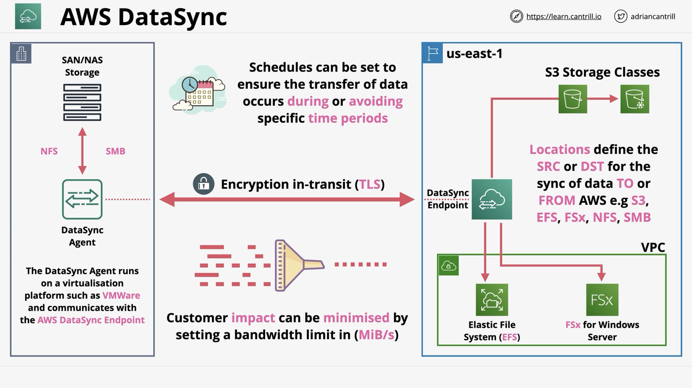

# AWS DataSync

- Data Transfer service TO and FROM AWS
- Migrations, Data Processing Transfers, Archival/Cost Effective Storage or DR/BC
- Designed to work at `huge scale`.
- Keeps metadata (e.g. permissions/timestamps).
- Built in `data validation`.
- Scalable - 10Gbps per agent (~100TB per day).
- Bandwidth Limiters (avoid link saturation).
- Incremental and scheduled transfer options.
- Compression and encryption.
- Automatic recovery from transit errors.
- AWS Service integration - S3, EFS, FSx.
- Pay as you use ... per GB cost for data moved.

## DataSync Components

- `Task` - A `job` with in DataSync, defines what is being synced, how quickly, FROM where and TO where.
- `Agent` - Software used to read or write to on-premises data stores using NFS or SMB.
- `Location` - every task has two locations FROM and TO. E.g. Network File System (NFS), Server Message Block (SMB), Amazon EFS, Amazon FSx and Amazon S3.
