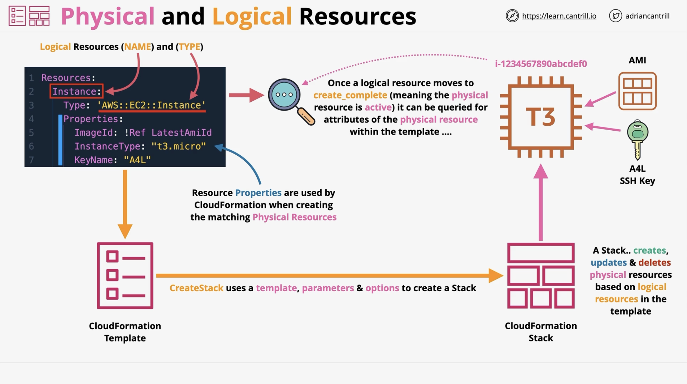
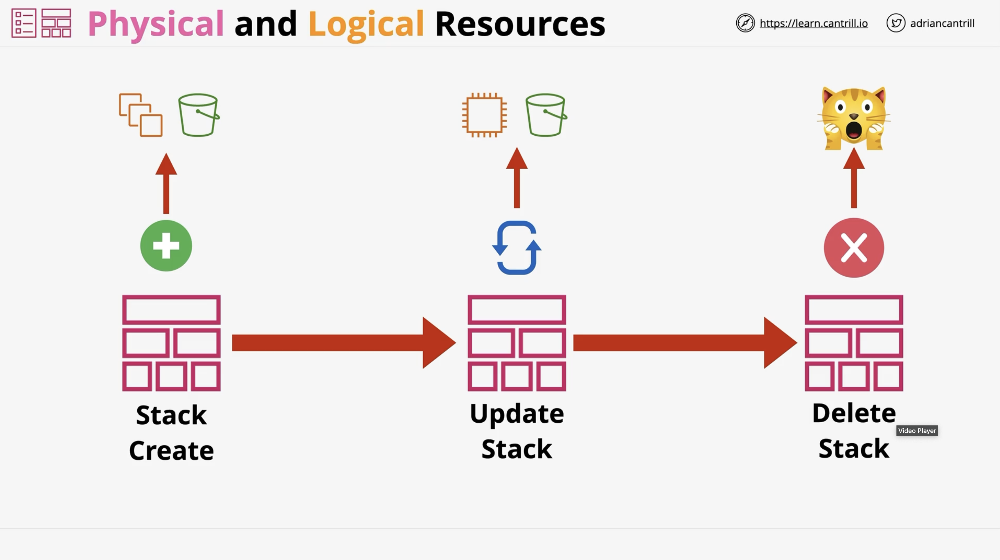
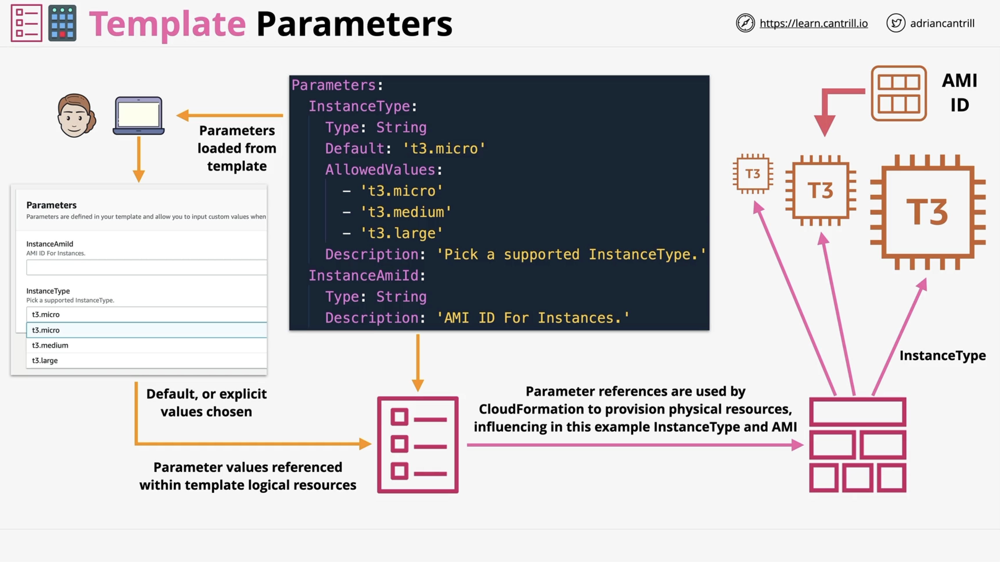
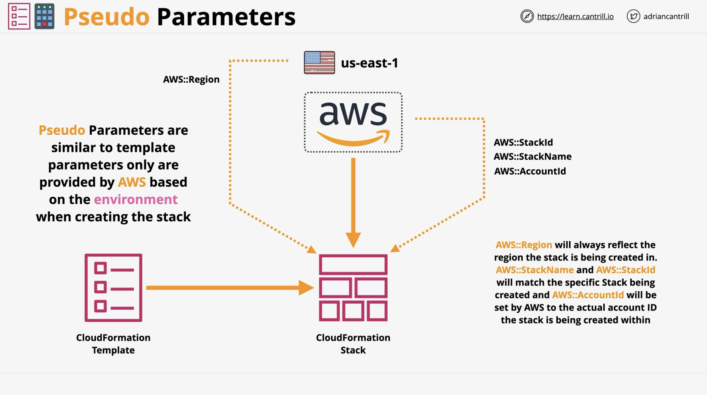
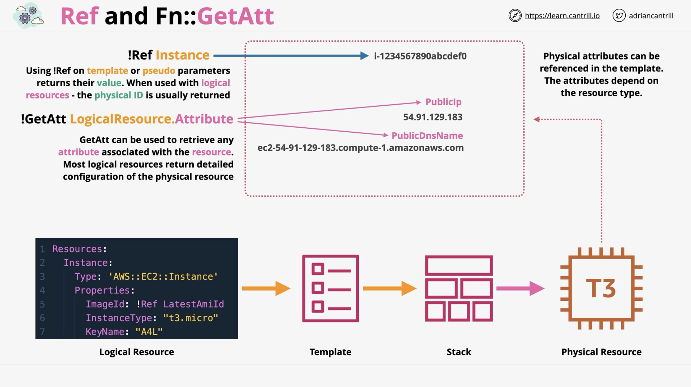

# CloudFormation

## CloudFormation Physical and Logical Resources

- CloudFormation Template - YAML or JSON
- .. contains logical resources - the "WHAT"
- Templates are used to create `Stacks`
- .. 1 stack, 100 stacks, 20.. stacks in each region
- .. stacks create `physical resources` from logical
- If a stacks template is changed - `physical` resources are changed
- If a stack is `deleted`, normally, the `physical` resources are delete

## Physical and Logical Resources

## Template and Pseudo Parameters

- `Template Parameters` accept input - console/CLI/API
- .. when a stack is `created` or `updated`
- Can be referenced from within `Logical Resources`
- .. influence `physical resources` and/or configuration
- Can be configured with `Defaults`, `AllowedValues`, `Min` and `Max` length & `AllowedPatterns`, `NoEcho` & `Type`

## Template Parameters

## Pseudo Parameters

## CloudFormation Intrinsic Functions

- Ref & Fn::GetAtt
- Fn::Join & Fn::Split
- Fn::GetAZs & Fn::Select
- Conditions (Fn:: IF, And, Equals, Not or Or)
- Fn::Base64 & Fn::Sub
- Fn::Cidr

### Ref and Fn::GetAtt

