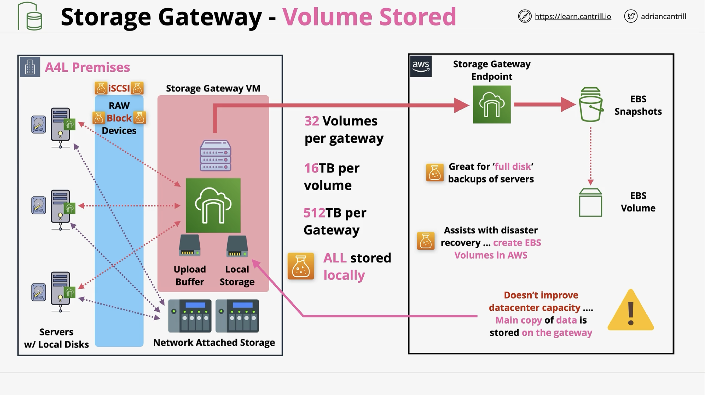
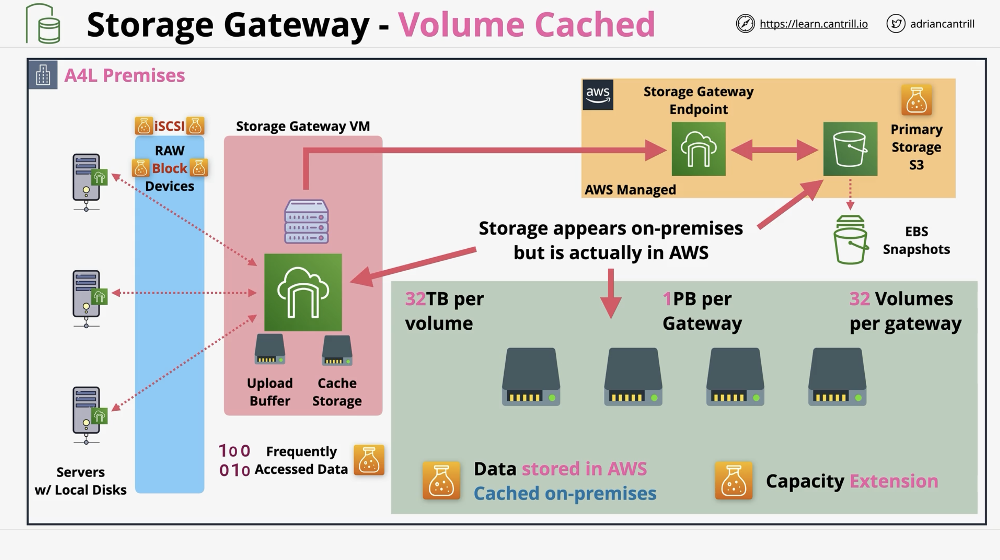
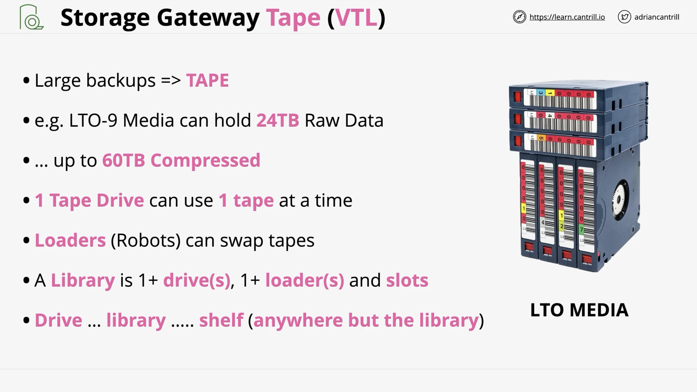
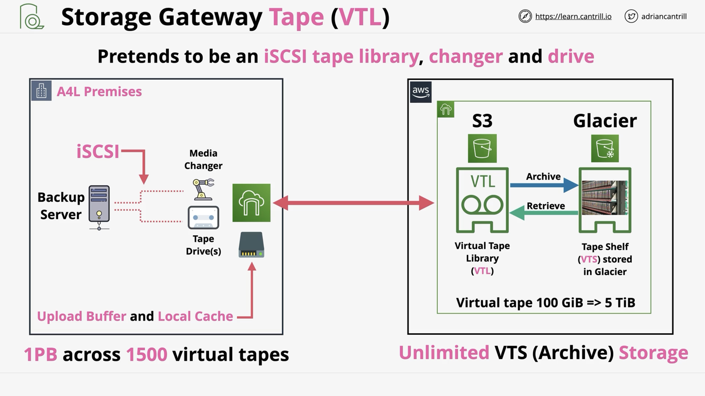
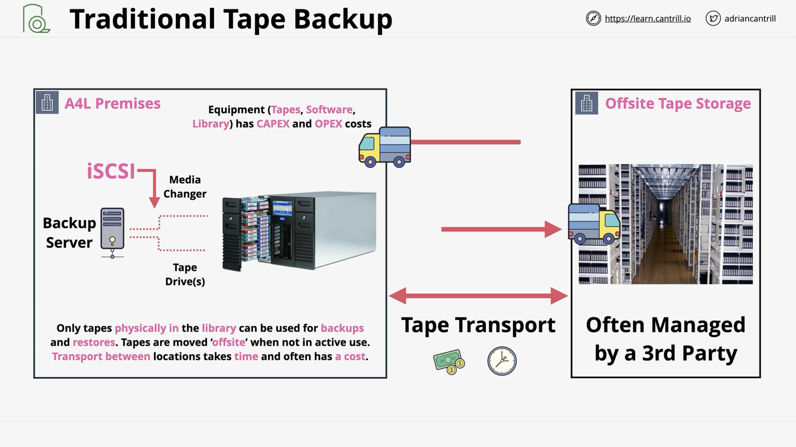
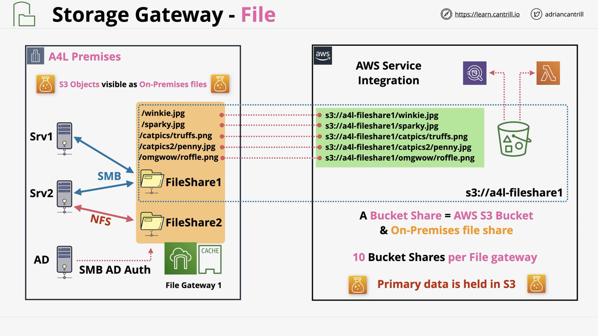
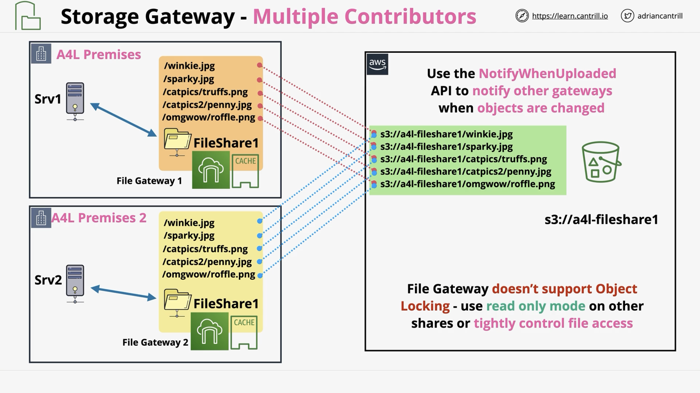
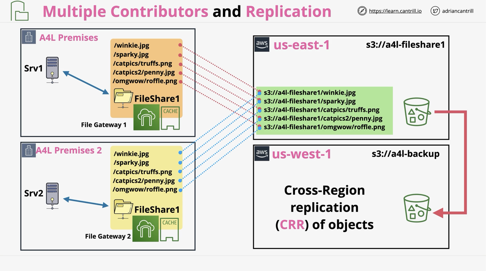
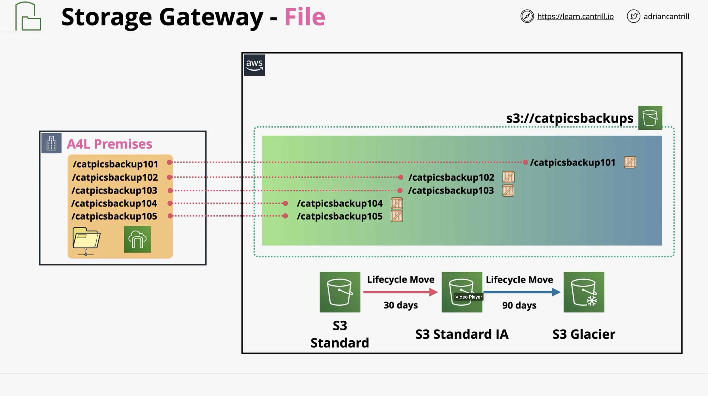

# Storage Gateway

## Storage Gateway - Volume Stored

## Storage Gateway - Volume Cached

## Storage Gateway - Tape

## Traditional Tape Backup

## Storage Gateway - File Mode

- Bridges on-premises file storage and S3.
- Mount Points (shares)  available via NFS or SMB.
- Map directly onto an S3 bucket.
- Files stored into a mount point, are visible as objects in an S3 bucket.
- Read and Write Caching ensure LAN-like performance.

